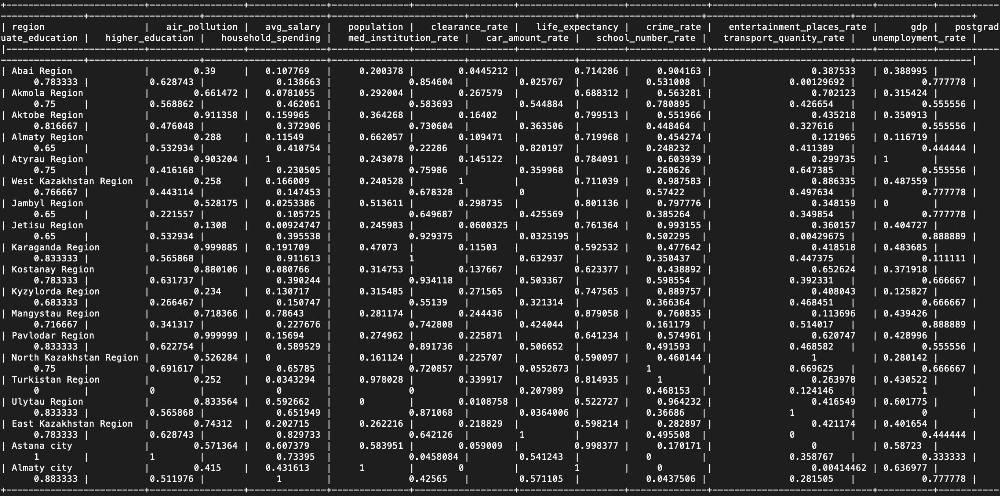
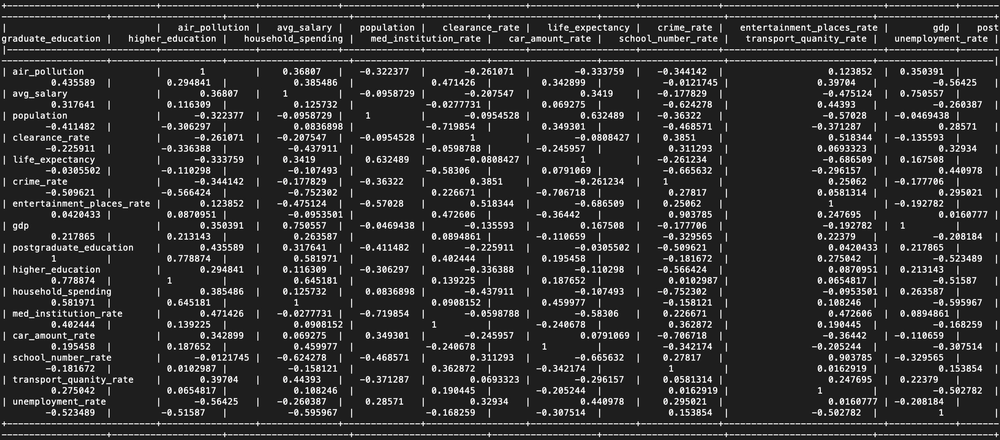
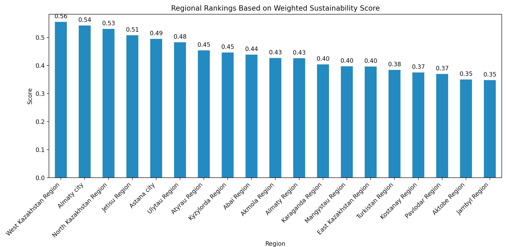
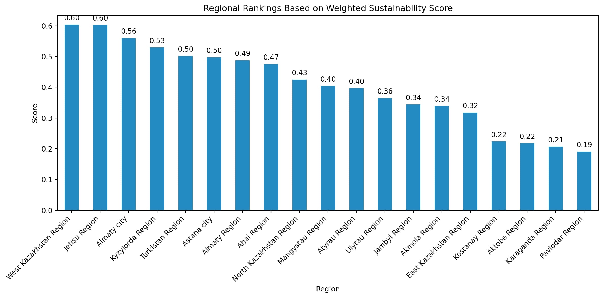
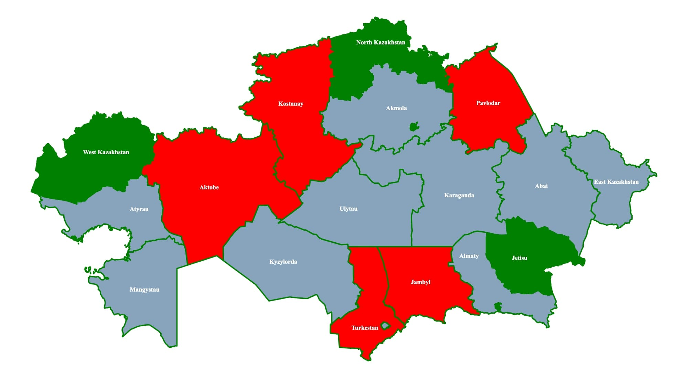
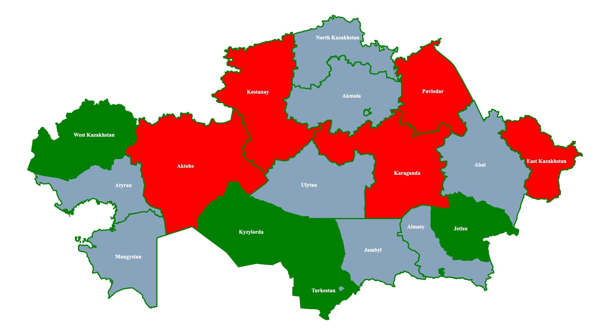
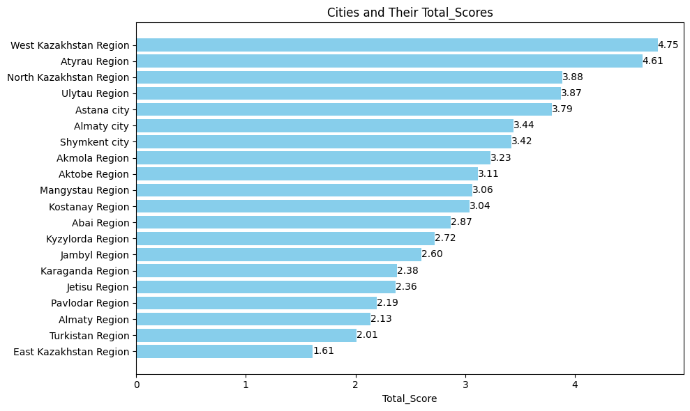
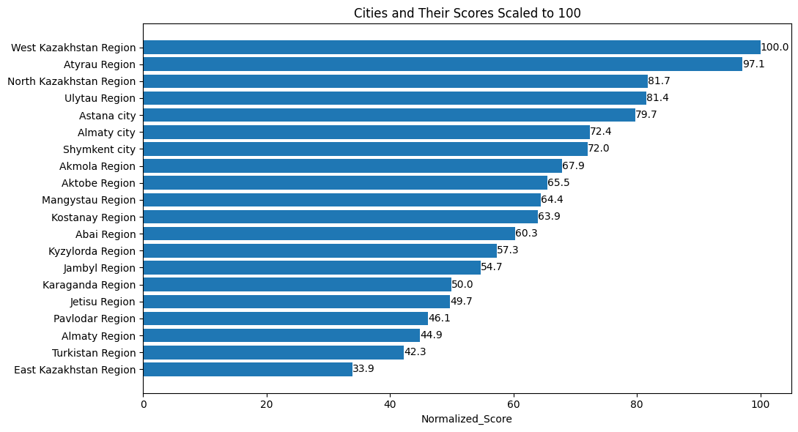
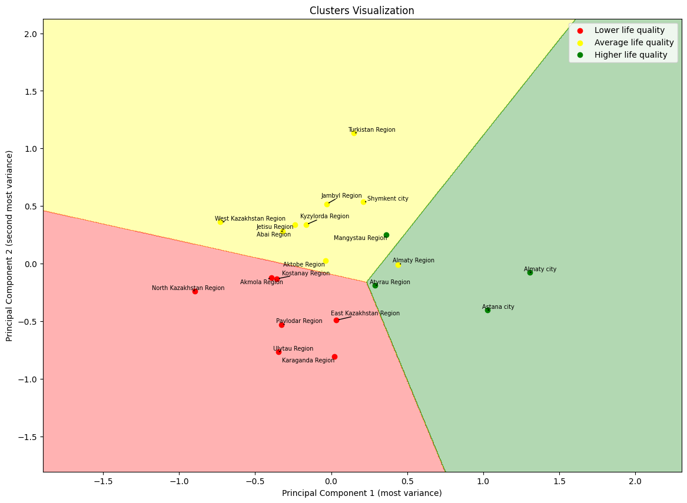
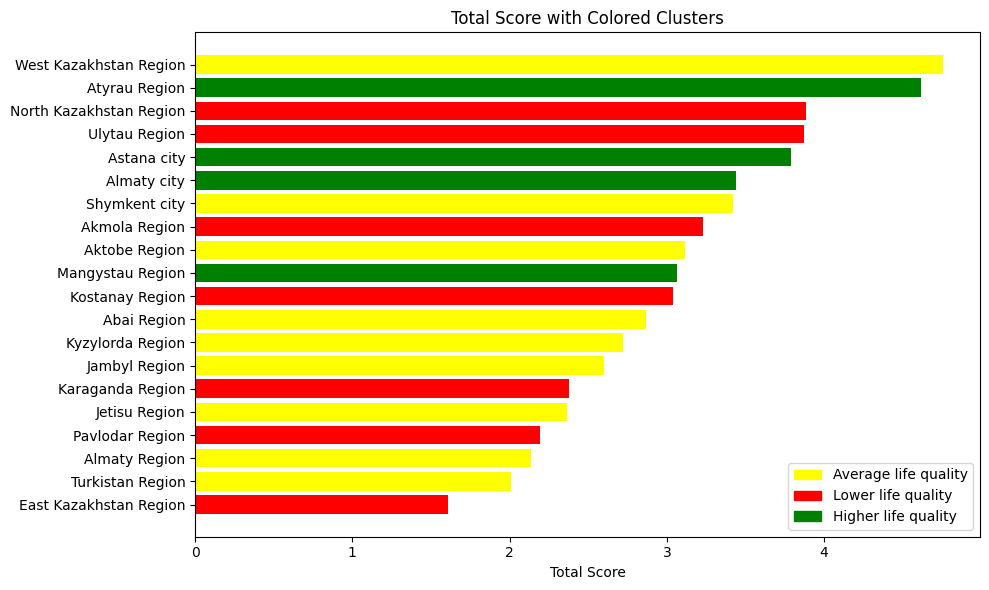

#### Sustainability Score
## Regions by sustainability score for Environmental importance weighting.
<PlotlyBarChart
  data={{
    url: 'data_new.csv'
  }}
  xAxis="Region"
  yAxis="Total_Score"
/>

<FlatUiTable
  data={{
    url: 'data_new.csv'
  }}
/>

# Aggregated sustainability indicators and ranking in urban areas of the Republic of Kazakhstan

This project provides an analysis of various cities based on multiple factors such as air pollution, crime rate, household spending, and unemployment rate. It uses a combination of data imputation, normalization, and visualization techniques to rank cities according to their overall scores using equal and Environmental importance weighting techniques for developing aggregated sustainability indicators for live quality evaluation in urban areas of the Republic of Kazakhstan.

## Source

All of the data is originally sourced from [The Bureau of National Statistics of Kazakhstan](stat.gov.kz) and later merged and cleaned for use in this project.

## Metadata

Metadata is based on [frictionlessdata's data package standard](https://specs.frictionlessdata.io/data-package/).

## Data

The dataset `merged_to_normalize.csv` contains various metrics for different cities. In total, 16 different parameters from our previous research were included.

We have also added some metadata such as column descriptions and [data packaged](https://specs.frictionlessdata.io/data-package/) it.

### Data Cleaning:
- The last row of the CSV is dropped as it might contain summary or unwanted data.
- Only numerical columns are selected for further processing.

### Imputation:
- Missing values in the numerical columns are imputed using K-Nearest Neighbors (KNN) with `n_neighbors=5`. This method takes the missing value, evaluates all of the other variables aside from it and then approximates the missing value based on 5 nearest matches from other regions.

### Normalization:
- Numerical data is scaled using `MinMaxScaler` to bring all values into the range [0, 1].

### Negative Indicators:
- Several columns representing negative indicators are adjusted so that higher values represent worse conditions. Namely, the following parameters have been concluded to negatively effect a region's rating:

- **air_pollution_index**: A metric indicating the level of air pollution
- **crime_amount**: Total number of crimes
- **household_spending_per_month**: Average household spending per month
- **unemployment-rate**: Unemployment rate in the city
- **car-amount-rate**: Number of cars per 1000 inhabitants

### Positive Indicators:
- The rest of the columns that represent positive indicators are as follows:

- **Region**: The name of the region or city.
- **avg_salary**: Average salary of the residents in the region.
- **Population**: Total population of the region.
- **gdp_per_capita**: Gross Domestic Product (GDP) per capita in Tenge.
- **Postgraduate_Education**: Proportion of the population with postgraduate education.
- **Higher_Education**: Proportion of the population with higher education.
- **life_expectancy**: Average life expectancy of the residents.
- **Med-institution-rate**: Number of medical institutions per 10000 inhabitants.
- **School-number-rate**: Number of schools per 10000 inhabitants in the region.
- **public_transport_quantity**: Quantity of public transportation per 10000 inhabitants.
- **Entertainment-places-rate**: Number of entertainment venues per 10000 inhabitants.
- **clearance_rate**: Rate at which crimes are solved divided by the amount of crimes
- **Total_Score**: An overall score or index derived from various metrics to assess the region's quality of life.

### Aggregated Sustainability Indicators
Summary of Normalized Indicators:

Correlation Matrix:

### Sustainability score

Regions by sustainability score for equally assigned weight:

Regions by sustainability score for Environmental importance weighting:

Regions with top 5(green) and bottom 5(red) sustainability score for equally assigned weight.

Regions with top 5 (green) and bottom 5(red) sustainability score for Environmental importance weighting.

### Clustering:
- KMeans clustering is performed on the normalized data (excluding the region and total score columns) to categorize cities into clusters based on their overall characteristics.
- PCA (Principal Component Analysis) is used to reduce the dimensions of the data for visualization purposes. This helps to visualize the clusters in a 2D space.
- Three clusters are used, each representing different levels of life quality: average, higher, and lower.

### Visualization:
- First, a horizontal bar plot is created to display the scores of each city:

- Then, the 'Total score' column is scaled again to represent values from 0 to 100, and a second graph is made for better clarity.

- After that, a PCA plot is created to visualize the clusters formed by KMeans. Each city is represented in a 2D space, colored according to its cluster:

- Finally, a bar chart is created where each city's bar is colored according to its cluster, providing a visual representation of both the total score and the cluster classification:

## Results

The script outputs a DataFrame showing the regions and their total scores, sorted in descending order. A bar plot is also generated to visually represent the rankings.

## License

This dataset is licensed under the Open Data Commons [Public Domain and Dedication License][pddl].

[pddl]: https://www.opendatacommons.org/licenses/pddl/1-0/

#### Published by Open Data Kazakhstan. [Github](https://github.com/open-data-kazakhstan)

